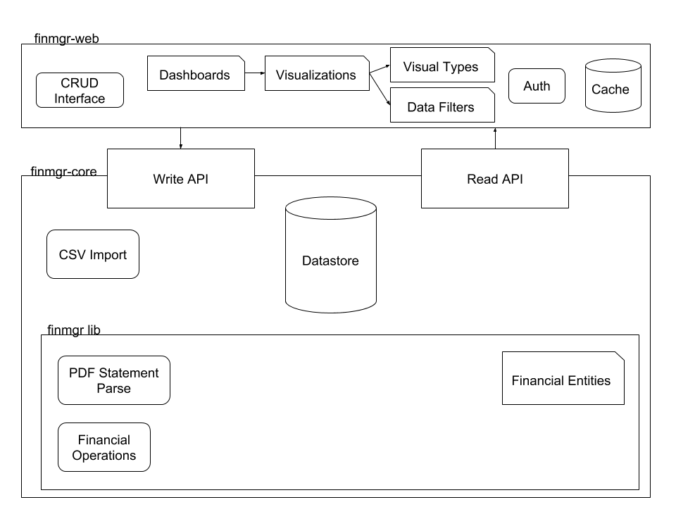

finmgr
===

A financial transaction framework

## Requirements

### finmgr-core, finmgr-lib

Java >= 11

Maven >= 3.6.3

### finmgr-web

Yarn >= 1.22.5

Node >= 14.16.1

## Installation

`mvn install`

## Running 

Project lifecycle is managed through Maven. `finmgr-web` (frontend) and `finmgr-core` (backend) can be launched independently.

#### finmgr-web

`yarn`

`yarn run start`

#### finmgr-core

`mvn package`

Use packaged jar file to deploy server API

## Testing

`mvn test`

## License

[GNU GPLv3](https://www.gnu.org/licenses/gpl-3.0.html)
